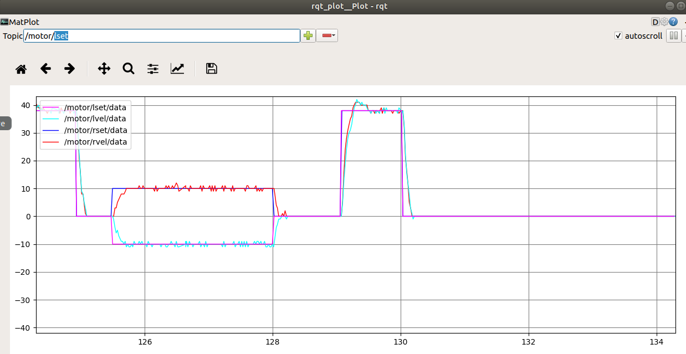

# View Node Topics With ROS

## Step 1: Check Node Topics

Connect SSH to the robot to open the terminal and enter the following command to enable the robot chassis node.
【Note: The robot chassis node cannot be restarted repeatedly, otherwise an error occurs. If the previous chassis node is not closed, it does not need to be restarted.】

```bash
roslaunch jetracer jetracer.launch    #Start the robot chassis node
```

Open the Ubuntu virtual machine terminal and enter the following command in the terminal to view the topic of the chassis node.

```bash
rostopic list
```

If the content shown in the figure below appears after running the code, it means that the multi-device communication is successful; if it cannot be connected, recheck whether the IP and hostname in the above steps are incorrect or whether they are connected to the same WiFi.

The topics you should see include:

- /cmd_vel is the topic of robot motion speed and is controlled by itself.
- /imu is the robot IMU topic.
- /motor/\* topics indicate the actual encoded speed and set the speed of the left and right motors.
- /odom encodes the odometer for the robot.
- /odom_combined is the robot fusion odometer, which is obtained by combining the encoded odometer with IMU data.

## Step 2: Display data waveform via rqt-plot

You can run the following command in the virtual machine terminal to open the data waveform display tool.

```bash
rosrun rqt_plot rqt_plot
```

Enter the topic of the motor in /Topic, and click + to add a topic to display the data waveform of the current motor.
Use the keyboard or remote control handle to control the movement of the robot to observe the changes of the motor curve. 【When there is a problem with the motor operation, you can also check the waveform for abnormalities.】


In the rqt_plot display, /motor/lset and /motor/rset represent the encoded speed set by the left and right motors, and /motor/lvel and /motor/rvel represent the encoded speed of the left and right motors actually running. This encoding speed indicates the number of pulses output by the encoder in one cycle.

## Step 3: Adjust PID parameters through rqt-reconfigure

You can run the following command in the virtual machine terminal to open the parameter adjustment tool.

```bash
rosrun rqt_reconfigure rqt_reconfigure
```


In the pop-up window, click the PID node on the left, and the PID parameters on the right can be dynamically modified according to your own preferences.
l_p, l_i, and l_d represent the PID parameters of the left wheel motor, and r_p, r_i, and r_d represent the PID parameters of the right wheel motor.
Usually we set P from large to small.

## Step 4: View robot odometer information via RVIZ image tool

You can run the following command in the virtual machine terminal to open the RVIZ tool.

```bash
rosrun rviz rviz
```

Click the Add button at the bottom left, select TF, and click OK to add the TF topic.


Click Fixed Frame and select 'odom', you can see three TF coordinates, control the car to move forward , and you can see that the base_footprint and base_imu_link coordinates also move at the same time.
Odom can be understood as the original position of the robot, base_footprint is the robot coordinates, and base_imu_link is the robot IMU coordinates.


Note: If the base_footprint coordinate keeps rotating, it is because the chassis master is not in a static state on the plane when it is started, and the IMU calibration data is inaccurate. Put the car on the plane and do not move, then press the reset button to restart the chassis master for a while and then run the node program.

## Step 5: View coordinate relationship by TF tree

You can run the following command in the virtual machine terminal to open the TF relationship visualization tools.

```bash
rosrun rqt_tf_tree rqt_tf_tree
```


Click the Refresh button on the left to display the TF relationship tree of the robot.
From this we can see that the robot coordinate system relationship is map->odom->base_link, in which map is the map coordinate system, odom is the odometer coordinate system published by the robot, and base_link is the robot's reference coordinate system.

## Step 6: View Robot IMU Information via RVIZ Image Tool

You can run the following command in the virtual machine terminal to open the RVIZ tool.

```bash
rosrun rviz rviz
```

Click the Add button at the bottom left, select Imu, and click OK to add the IMU topic.


Now you can add a display item, add Axes, and set the reference frame to imu_link.
Imu Topic choose "/imu" to view the IMU information, choose Enable box to display the box and check to Enable axes to display the coordinates. Check Enable acceleration to display the arrow. Set Acc. vector scale as 0.2 to minimize the arrow.


Rotate the car and the box will rotate too.

## Troubleshooting

### Cannot See Any Topics

1. Verify the ROS master node is running on the Jetson Nano
2. Check network connectivity between VM and Jetson Nano
3. Confirm that ROS environment variables are properly set

### rqt_plot Shows No Data

1. Make sure the correct topic is selected
2. Verify the robot chassis node is running
3. Check if sensors are properly connected and functioning

### RVIZ Display Issues

1. Make sure you have selected the correct fixed frame
2. Check if transforms are being published properly
3. Verify the topic data format matches the visualization tool expectations

## References

For more detailed instructions, refer to the [official Waveshare JetRacer ROS AI Kit Tutorial VI: View Node Topics With ROS](https://www.waveshare.com/wiki/JetRacer_ROS_AI_Kit_Tutorial_VI:_View_Node_Topics_With_ROS).
