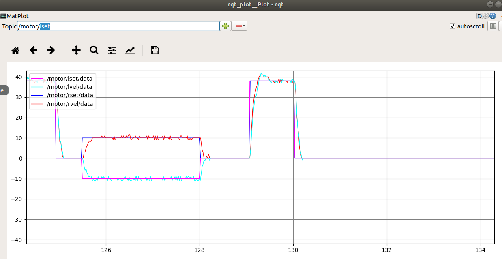
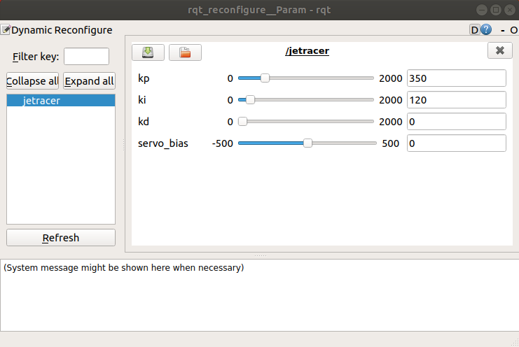
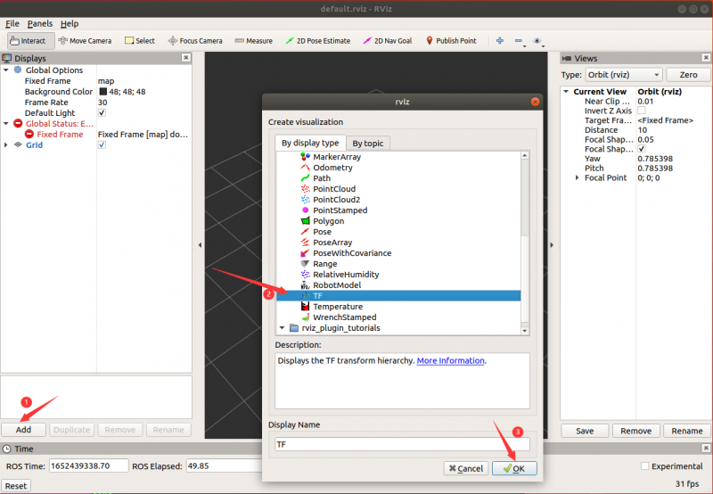
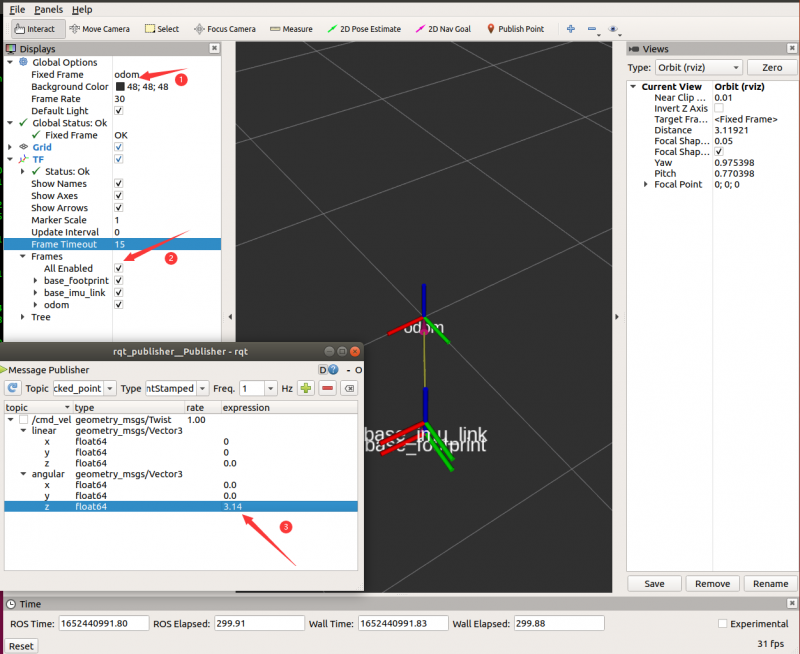
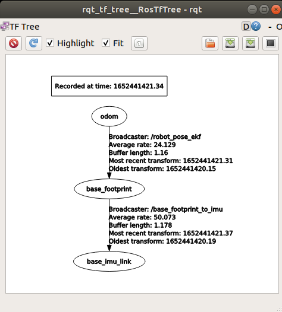
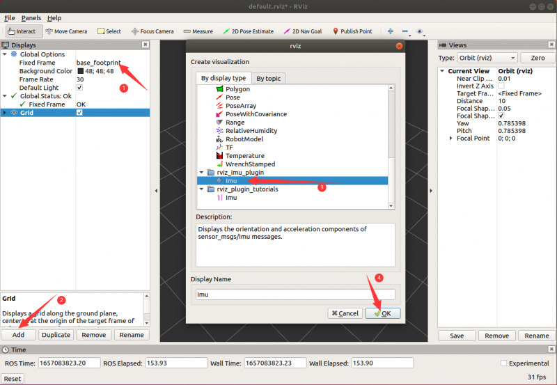
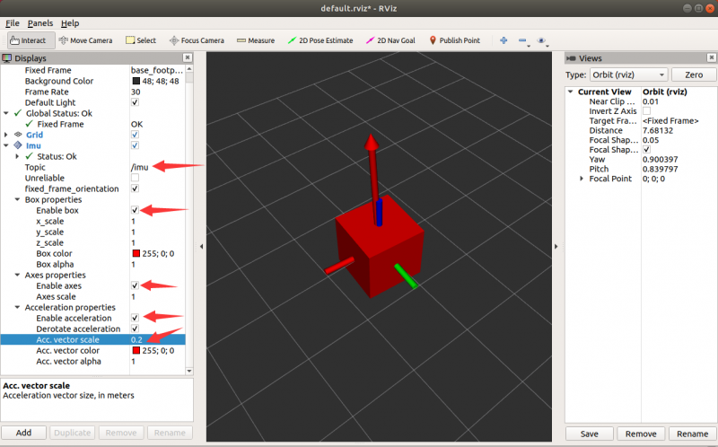

# Zobrazenie tém uzlov pomocou ROS

## Krok 1: Kontrola tém uzlov

Pripojte sa cez SSH k robotovi, otvorte terminál a zadajte nasledujúci príkaz na aktiváciu uzla podvozku robota.
【Poznámka: Uzol podvozku robota nemôže byť opakovane reštartovaný, inak dôjde k chybe. Ak predchádzajúci uzol podvozku nebol zatvorený, nie je potrebné ho reštartovať.】

```bash
roslaunch jetracer jetracer.launch    #Spustenie uzla podvozku robota
```

Otvorte terminál virtuálneho stroja Ubuntu a zadajte nasledujúci príkaz v termináli na zobrazenie tém uzla podvozku.

```bash
rostopic list
```

Ak sa po spustení kódu zobrazí obsah znázornený na obrázku nižšie, znamená to, že komunikácia medzi viacerými zariadeniami je úspešná; ak sa nedá pripojiť, skontrolujte, či IP a názov hostiteľa vo vyššie uvedených krokoch nie sú nesprávne alebo či sú pripojené k rovnakej WiFi.

Medzi témy, ktoré by ste mali vidieť, patria:

- /cmd_vel je téma rýchlosti pohybu robota a je ovládaná samotným robotom.
- /imu je téma IMU robota.
- /motor/\* témy indikujú skutočnú kódovanú rýchlosť a nastavujú rýchlosť ľavého a pravého motora.
- /odom kóduje odometer pre robota.
- /odom_combined je fúzny odometer robota, ktorý sa získava kombináciou kódovaného odometra s údajmi IMU.

## Krok 2: Zobrazenie dátovej vlny pomocou rqt-plot

V termináli virtuálneho stroja môžete spustiť nasledujúci príkaz na otvorenie nástroja na zobrazenie dátových vĺn.

```bash
rosrun rqt_plot rqt_plot
```

Zadajte tému motora v /Topic a kliknite na + pre pridanie témy na zobrazenie dátovej vlny aktuálneho motora.
Použite klávesnicu alebo diaľkový ovládač na ovládanie pohybu robota a sledujte zmeny krivky motora. 【Keď sa vyskytne problém s prevádzkou motora, môžete tiež skontrolovať, či vlna nevykazuje abnormality.】


V zobrazení rqt_plot, /motor/lset a /motor/rset predstavujú kódovanú rýchlosť nastavenú ľavým a pravým motorom, a /motor/lvel a /motor/rvel predstavujú kódovanú rýchlosť ľavého a pravého motora, ktorá skutočne beží. Toto kódovanie rýchlosti označuje počet impulzov vydaných enkóderom v jednom cykle.

## Krok 3: Úprava PID parametrov cez rqt-reconfigure

V termináli virtuálneho môžete spustiť nasledujúci príkaz na otvorenie nástroja na úpravu parametrov.

```bash
rosrun rqt_reconfigure rqt_reconfigure
```



V kontextovom okne kliknite na uzol PID na ľavej strane a PID parametre na pravej strane môžete dynamicky upravovať podľa vlastných preferencií.
l_p, l_i a l_d predstavujú PID parametre motora ľavého kolesa a r_p, r_i a r_d predstavujú PID parametre motora pravého kolesa.
Zvyčajne nastavujeme P od veľkého po malé.

## Krok 4: Zobrazenie informácií o odometri robota pomocou nástroja RVIZ

V termináli virtuálneho stroja môžete spustiť nasledujúci príkaz na otvorenie nástroja RVIZ.

```bash
rosrun rviz rviz
```

Kliknite na tlačidlo Add v ľavom dolnom rohu, vyberte TF a kliknite na OK pre pridanie témy TF.


Kliknite na Fixed Frame a vyberte 'odom', uvidíte tri súradnice TF, ovládajte auto na pohyb dopredu a uvidíte, že súradnice base_footprint a base_imu_link sa tiež súčasne pohybujú.
Odom možno chápať ako pôvodnú polohu robota, base_footprint sú súradnice robota a base_imu_link sú súradnice IMU robota.


Poznámka: Ak sa súradnica base_footprint neustále otáča, je to preto, že hlavný podvozok nebol pri spustení v statickom stave na rovine a kalibračné údaje IMU sú nepresné. Položte auto na rovinu a nehýbte ním, potom stlačte tlačidlo reset na reštartovanie hlavného podvozku, chvíľu počkajte a potom spustite program uzla.

## Krok 5: Zobrazenie vzťahu súradníc pomocou stromu TF

V termináli virtuálneho stroja môžete spustiť nasledujúci príkaz na otvorenie nástrojov na vizualizáciu vzťahu TF.

```bash
rosrun rqt_tf_tree rqt_tf_tree
```



Kliknite na tlačidlo Refresh na ľavej strane pre zobrazenie stromu vzťahov TF robota.
Z toho môžeme vidieť, že vzťah súradnicových systémov robota je map->odom->base_link, pričom map je súradnicový systém mapy, odom je súradnicový systém odometra publikovaný robotom a base_link je referenčný súradnicový systém robota.

## Krok 6: Zobrazenie informácií o IMU robota pomocou nástroja RVIZ

V termináli virtuálneho stroja môžete spustiť nasledujúci príkaz na otvorenie nástroja RVIZ.

```bash
rosrun rviz rviz
```

Kliknite na tlačidlo Add v ľavom dolnom rohu, vyberte Imu a kliknite na OK pre pridanie témy IMU.


Teraz môžete pridať položku zobrazenia, pridať Axes a nastaviť referenčný rámec na imu_link.
Imu Topic vyberte "/imu" na zobrazenie informácií o IMU, vyberte Enable box na zobrazenie box a zaškrtnite Enable axes na zobrazenie súradníc. Zaškrtnite Enable acceleration na zobrazenie šípky. Nastavte Acc. vector scale na 0,2 na minimalizáciu šípky.


Otočte auto a box sa tiež otočí.

## Riešenie problémov

### Nie je možné vidieť žiadne témy

1. Overte, či na Jetson Nano beží hlavný uzol ROS
2. Skontrolujte sieťové pripojenie medzi VM a Jetson Nano
3. Potvrďte, že premenné prostredia ROS sú správne nastavené

### rqt_plot nezobrazuje žiadne údaje

1. Uistite sa, že je vybraná správna téma
2. Overte, či beží uzol podvozku robota
3. Skontrolujte, či sú senzory správne pripojené a fungujú

### Problémy so zobrazením v RVIZ

1. Uistite sa, že ste vybrali správny pevný rámec
2. Skontrolujte, či sa transformácie správne publikujú
3. Overte, či formát údajov témy zodpovedá očakávaniam vizualizačného nástroja

## Referencie

Pre podrobnejšie pokyny si pozrite [oficiálny návod Waveshare JetRacer ROS AI Kit Tutorial VI: Zobrazenie tém uzlov pomocou ROS](https://www.waveshare.com/wiki/JetRacer_ROS_AI_Kit_Tutorial_VI:_View_Node_Topics_With_ROS).
